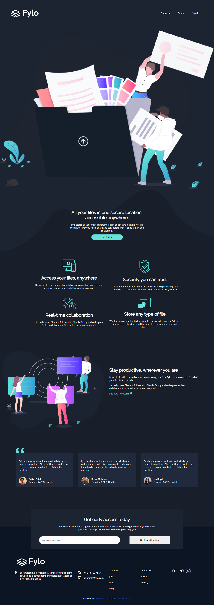

# Frontend Mentor - Fylo dark theme landing page solution

This is a solution to the [Fylo dark theme landing page challenge on Frontend Mentor](https://www.frontendmentor.io/challenges/fylo-dark-theme-landing-page-5ca5f2d21e82137ec91a50fd). Frontend Mentor challenges help you improve your coding skills by building realistic projects. 

## Table of contents

- [Overview](#overview)
  - [The challenge](#the-challenge)
  - [Screenshot](#screenshot)
  - [Links](#links)
- [My process](#my-process)
  - [Built with](#built-with)
  - [What I learned](#what-i-learned)
  - [Continued development](#continued-development)
  - [Useful resources](#useful-resources)
- [Author](#author)

## Overview

### The challenge

Users should be able to:

- View the optimal layout for the site depending on their device's screen size
- See hover states for all interactive elements on the page

### Screenshot

### Links

- Solution URL: [Add solution URL here](https://your-solution-url.com)
- Live Site URL: [Add live site URL here](https://your-live-site-url.com)

## My process

### Built with

- HTML5 
- CSS3
- Flexbox
- CSS Grid

### What I learned

I learned how to use flexbox and css grid to make responsive columns 

### Continued development

I plan to keep practicing flexbox and grid to get more conversant with it 

### Useful resources

- [ resource 1](https://www.w3schools.com) - This helped me when i got stuck with a syntax, it also helped me understan flexbox and grid better.
- [Example resource 2](https://developer.mozilla.org) - I found some articles here that also helped me during the course of working on the project. 

## Author

- Frontend Mentor - [@samuel-jacobs](https://www.frontendmentor.io/profile/samuel-jacobs)
- Twitter - [@_samueljacobs_](https://www.twitter.com/_samueljacobs_)

